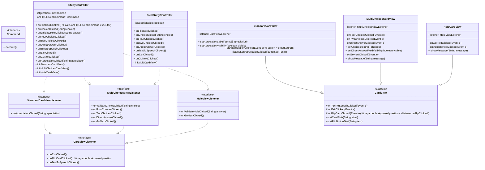

```mermaid
classDiagram
    
    class Command {
        <<interface>>
        + execute()
    }
    
    class StudyController {
        - isQuestionSide: boolean
%%        - currentCardType: CardType
        
        - onFilpClickedCommand: Command
        
        + onFlipCardClicked() % calls onFilpClickedCommand.execute()
        + onChoiceClicked(String choice)
        + onValidateHoleClicked(String answer)
        + onFourChoicesClicked()
        + onTwoChoicesClicked()
        + onDirectAnswerClicked()
        
        + onTextToSpeechClicked()
        
        + onExitClicked()
        + onGoNextClicked()
        + onApreciationClicked(String apreciation)
        
        - initStandardCardView()
        - initMultiChoicesCardView()
        - initHoleCardView()
    }
    StudyController ..|> StandardCardViewListener
    StudyController ..|> MultiChoicesViewListener
    StudyController ..|> HoleViewListener
    
    class FreeStudyController {
        - isQuestionSide: boolean
        
        + onFlipCardClicked()
        + onChoiceClicked(String choice)
        + onFourChoicesClicked()
        + onTwoChoicesClicked()
        + onDirectAnswerClicked()
        
        + onTextToSpeechClicked()
        
        + onExitClicked()
        + onGoNextClicked()
        
        - initMultiCardView()
    }
    FreeStudyController ..|> MultiChoicesViewListener

    class CardView {
        <<abstract>>
        # onTextToSpeechClicked(Event e)
        # onExitClicked(Event e)
        # onFlipCardClicked(Event e) % regarder la réponse/question -> listener.onFlipClicked()
        + setCardSide(String label)
        + setFlipButtonText(String text)
    }

    class CardViewListener {
        <<interface>>
        + onExitClicked()
        + onFlipCardClicked() % regarder la réponse/question
        + onTextToSpeechClicked()
    }
    
    class StandardCardView {
        - listener: CardViewListener
        
        + setApreciationLabel(String[] apreciation)
        + setApreciationVisibility(boolean visible)
        - onAppreciationClicked(Event e) % button = e.getSoure(); listener.onApreciationClicked(button.getText())
    }
    StandardCardView --|> CardView
    
    class StandardCardViewListener {
        <<interface>>
        + onApreciationClicked(String apreciation)
    }
    StandardCardViewListener ..|> CardViewListener
    
    class MultiChoicesCardView {
        - listener: MultiChoicesViewListener
        
        - onFourChoicesClicked(Event e)
        - onTwoChoicesClicked(Event e)
        - onDirectAnswerClicked(Event e)
        
        + setChoices(String[] choices)
        + setDirectAnswerFieldVisibility(boolean visible)
        
        - onGoNextClicked(Event e)
        
        + showMessage(String message)
    }
    MultiChoicesCardView --|> CardView

    class MultiChoicesViewListener {
        <<interface>>
        + onValidateChoiceClicked(String choice)
        + onFourChoicesClicked()
        + onTwoChoicesClicked()
        + onDirectAnswerClicked()
        + onGoNextClicked()
    }
    MultiChoicesViewListener ..|> CardViewListener
    
    class HoleCardView {
        - listener: HoleViewListener

        - onGoNextClicked(Event e)
        - onValidateHoleClicked(Event e)
        + showMessage(String message)
    }
    HoleCardView --|> CardView
    
    class HoleViewListener {
        <<interface>>
        + onValidateHoleClicked(String answer)
        + onGoNextClicked()
    }
    HoleViewListener ..|> CardViewListener
```